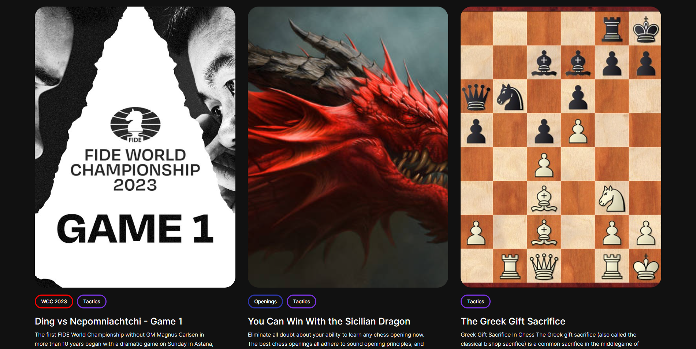
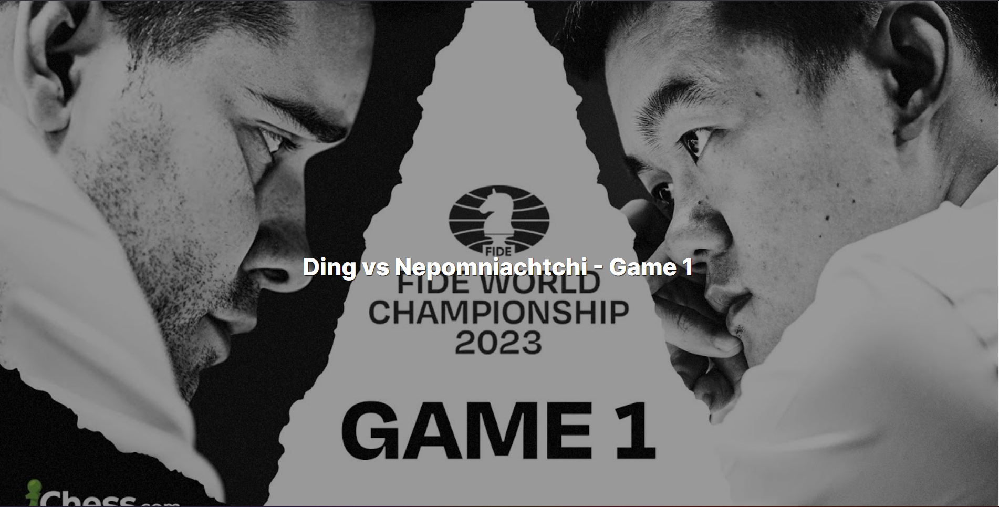
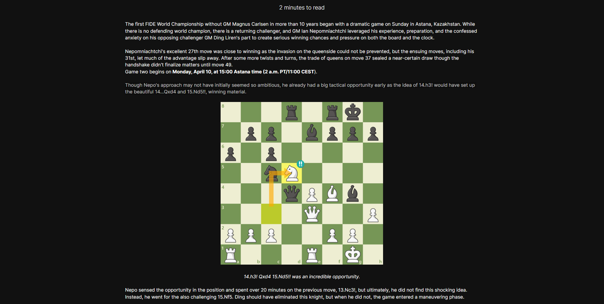
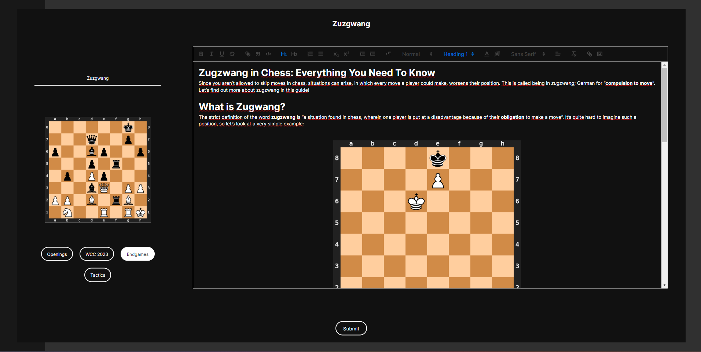
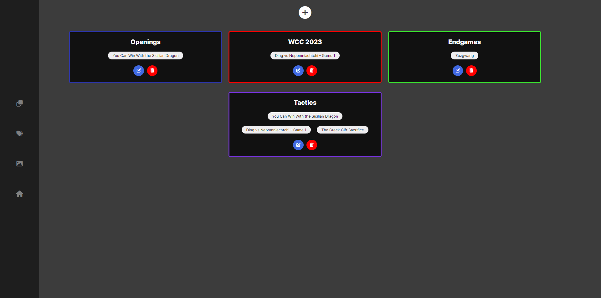
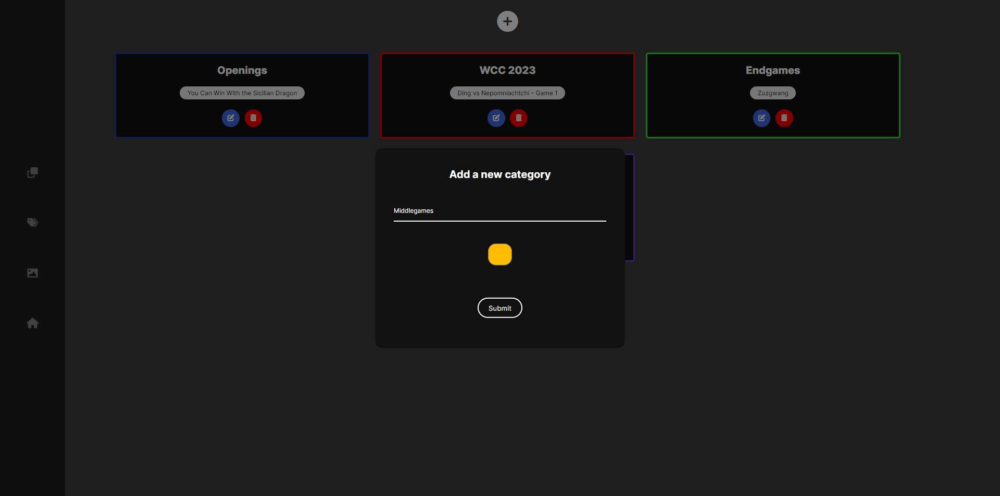
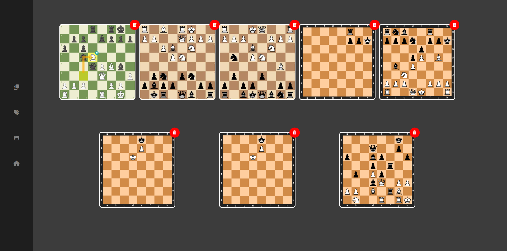

# 🏆 Chess blog

# Preview links :
- [🏠 Home page](https://blog-propiesek.vercel.app/)
- [📝 Post page](https://blog-propiesek.vercel.app/ding-vs-nepomniachtchi---game-1)

# Table of Contents

- [❓ About the app](#❓-about-the-app)
  - [🚀 Features](#🚀-features)
- [💡 Motivation](#💡-motivation)
- [💻 Technology stack](#💻-technology-stack)
- [📷 Screenshots](#📷-screenshots)
  - [🏠 Home page](#🏠-home-page)
  - [📝 Post page](#📝-post-page)
    - [🧾 Post header](#🧾-post-header)
    - [📄 Post content](#📄-post-content)
  - [👨‍💼 Admin dashboard](#👨‍💼-admin-dashboard)
    - [📝 Posts panel](#📝-posts-panel)
    - [🆕 Post creation](#🆕-post-creation)
    - [🗃️ Categories panel](#🗃️-categories-panel)
    - [➕ Categories creation](#➕-categories-creation)
    - [🖼️ Images panel](#🖼️-images-panel)
- [📧 Contact](#📧-contact)

# ❓ About the app
This was my first ever CRUD project. It's a simple blog, with admin-only management.

## 🚀 Features
- managing categories
- managing posts (with categories if you want to) using WYSIWYG editor
- displaying posts preview on the home page
- displaying single post

# 💡 Motivation
My motivation was to create a blog, where I can post chess content as it's my hobby.

# 💻 Technology stack

- [SvelteKit](https://kit.svelte.dev/) - For front-end and back-end
- [SASS](https://sass-lang.com/) - For styling
- [Quill](https://quilljs.com/) - For WYSIWYG editor
- [Prisma](https://www.prisma.io/) - As a ORM for database
- [PlanetScale](https://planetscale.com/)- As the database
- [supabase](https://supabase.com/) - As the storage
- [JWT](https://jwt.io/) - For auth
- [Vercel](https://vercel.com/) - For deployment

# 📷 Screenshots

## 🏠 Home page

## 📝 Post page

### 🧾 Post header

### 📄 Post content

## 👨‍💼 Admin dashboard

### 📝 Posts panel

### 🆕 Post creation

### 🗃️ Categories panel

### ➕ Categories creation

### 🖼️ Images panel

# 📧 Contact
Feel free to contact me, message me on Discord @macias#9277 😄🙏.